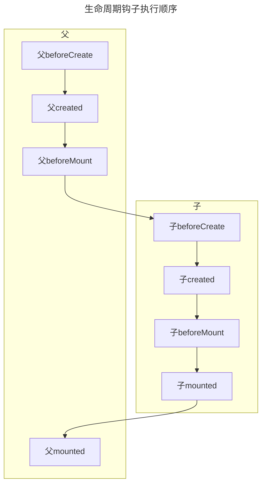

# vue的生命周期

## 生命周期VUE2

beforeCreate	执行时组件实例还未创建，通常用于插件开发中执行一些初始化任务

created	组件初始化完毕，各种数据可以使用，常用于异步数据获取

beforeMount	未执行渲染、更新，dom未创建

mounted	初始化结束，dom已创建，可用于获取访问数据和dom元素

beforeUpdate	更新前，可用于获取更新前各种状态

updated	更新后，所有状态已是最新

beforeDestroy	销毁前，可用于一些定时器或订阅的取消

destroyed	组件已销毁，作用同上

::: tip created和mounted请求区别

created 比mounted 提前，请求提前发个人认为要好一些，mounted 也可以，不过可能会出现页面渲染出来了但数据还没回来的情况，因为此时 DOM 已经挂载完毕，更改数据会让会导致组件重复渲染一次（当然如果接口慢的话 created 里面也有可能出现这个情况，但created请求的早所以比mounted还是要快一些）

:::
## 生命周期VUE3

::: tip 建议直接看官方文档

组合式：https://cn.vuejs.org/api/composition-api-lifecycle.html
选项式：https://cn.vuejs.org/api/options-lifecycle.html
:::
## vue父子组件生命周期钩子执行顺序

子组件更新过程:

1.影响父组件 父beforeUpdate -> 子beforeUpdate -> 子updated -> 父updated

2.不影响父组件 子beforeUpdate -> 子updated

父组件更新过程:

1.影响到子组件 父beforeUpdate -> 子beforeUpdate -> 子updated -> 父updted

2.不影响子组件 父beforeUpdate -> 父updated

销毁过程： ⽗beforeDestroy -> ⼦beforeDestroy -> ⼦destroyed -> ⽗destroyed

::: tip 

生命周期不管是什么情况都是父组件等子组件完成后 才会执行自己对应完成的钩子

:::